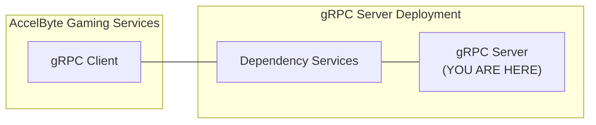

# lootbox-roll-function-grpc-plugin-server-go



`AccelByte Gaming Services` capabilities can be extended using custom functions implemented in a `gRPC server`. If configured, custom functions in the `gRPC server` will be called by `AccelByte Gaming Services` instead of the default function.

The `gRPC server` and the `gRPC client` can actually communicate directly. However, additional services are necessary to provide **security**, **reliability**, **scalability**, and **observability**. We call these services as `dependency services`. The [grpc-plugin-dependencies](https://github.com/AccelByte/grpc-plugin-dependencies) repository is provided as an example of what these `dependency services` may look like. It
contains a docker compose which consists of these `dependency services`.

> :warning: **grpc-plugin-dependencies is provided as example for local development purpose only:** The dependency services in the actual gRPC server deployment may not be exactly the same.

## Overview

This repository contains a `sample lootbox roll function gRPC server app` written in `Go`. It provides a simple custom lootbox roll function for platform service in `AccelByte Gaming Services`.

This sample app also shows how this `gRPC server` can be instrumented for better observability. 
It is configured by default to send metrics, traces, and logs to the observability `dependency services` in [grpc-plugin-dependencies](https://github.com/AccelByte/grpc-plugin-dependencies).


## Prerequisites

1. Windows 10 WSL2 or Linux Ubuntu 20.04 with the following tools installed.

   a. bash

   b. make

   c. docker v23.x

   d. docker-compose v2.x

   e. docker loki driver

      ```
      docker plugin install grafana/loki-docker-driver:latest --alias loki --grant-all-permissions
      ```

   f. go 1.19

   g. git

   h. [ngrok](https://ngrok.com/)

   i. [postman](https://www.postman.com/)

2. A local copy of [grpc-plugin-dependencies](https://github.com/AccelByte/grpc-plugin-dependencies) repository.

   ```
   git clone https://github.com/AccelByte/grpc-plugin-dependencies.git
   ```

3. Access to `AccelByte Gaming Services` demo environment.

    a. Base URL: https://demo.accelbyte.io.

    b. [Create a Game Namespace](https://docs.accelbyte.io/esg/uam/namespaces.html#tutorials) if you don't have one yet. Keep the `Namespace ID`.

    c. [Create an OAuth Client](https://docs.accelbyte.io/guides/access/iam-client.html) with `confidential` client type. Keep the `Client ID` and `Client Secret`.

## Setup

To be able to run this sample app, you will need to follow these setup steps.

1. Create a docker compose `.env` file by copying the content of [.env.template](.env.template) file. 
2. Fill in the required environment variables in `.env` file as shown below.

   ```
   AB_BASE_URL=https://demo.accelbyte.io      # Base URL of AccelByte Gaming Services demo environment
   AB_CLIENT_ID='xxxxxxxxxx'                  # Use Client ID from the Prerequisites section
   AB_CLIENT_SECRET='xxxxxxxxxx'              # Use Client Secret from the Prerequisites section
   AB_NAMESPACE='xxxxxxxxxx'                  # Use Namespace ID from the Prerequisites section
   PLUGIN_GRPC_SERVER_AUTH_ENABLED=false      # Enable or disable access token and permission verification
   ```

   > :warning: **Keep PLUGIN_GRPC_SERVER_AUTH_ENABLED=false for now**: It is currently not
   supported by `AccelByte Gaming Services`, but it will be enabled later on to improve security. If it is
   enabled, the gRPC server will reject any calls from gRPC clients without proper authorization
   metadata.

## Building

To build this sample app, use the following command.

```
make build
```

## Running

To (build and) run this sample app in a container, use the following command.

```
docker-compose up --build
```

## Testing

### Functional Test in Local Development Environment

The custom functions in this sample app can be tested locally using `postman`.

1. Run the `dependency services` by following the `README.md` in the [grpc-plugin-dependencies](https://github.com/AccelByte/grpc-plugin-dependencies) repository.

   > :warning: **Make sure to start dependency services with mTLS disabled for now**: It is currently not supported by `AccelByte Gaming Services`, but it will be enabled later on to improve security. If it is enabled, the gRPC client calls without mTLS will be rejected.

2. Run this `gRPC server` sample app.

3. Open `postman`, create a new `gRPC request` (tutorial [here](https://blog.postman.com/postman-now-supports-grpc/)), and enter `localhost:10000` as server URL. 

   > :exclamation: We are essentially accessing the `gRPC server` through an `Envoy` proxy in `dependency services`.

4. Still in `postman`, continue by selecting `LootBox/RollLootBoxRewards` method and invoke it with the sample message below.

   ```json
   {
      "userId": "b52a2364226d436285c1b8786bc9cbd1",
      "namespace": "accelbyte",
      "quantity": 10,
      "itemInfo": {
         "itemId": "8a0b8bda28c845f6938cc57540af452e",
         "itemSku": "SKU3170",
         "rewardCount": 2,
         "lootBoxRewards": [
               {
                  "name": "Foods",
                  "type": "REWARD",
                  "weight": 5,
                  "odds": 0,
                  "items": [
                     {
                           "itemId": "8b6016d243264c0f90031600313b8a37",
                           "itemSku": "SKU4650",
                           "count": 5
                     }                 
                  ]
               },
               {
                  "name": "Beverages",
                  "type": "REWARD",
                  "weight": 4,
                  "odds": 0,
                  "items": [
                     {
                           "itemId": "dd81bbc3d9fd413daecfd0d0e53fc095",
                           "itemSku": "SKU1939",
                           "count": 13
                     }            
                  ]
               },
               {
                  "name": "Specials",
                  "type": "REWARD",
                  "weight": 1,
                  "odds": 0,
                  "items": [
                     {
                           "itemId": "3318d5fe505a4891b6b5a70586b294ca",
                           "itemSku": "SKU1739",
                           "count": 21
                     }
                  ]
               }
         ]
      }
   }
   ```

5. If successful, you will see the rolled reward(s) in the response.

   ```json
   {
      "rewards": [
         {
            "itemId": "8b6016d243264c0f90031600313b8a37",
            "itemSku": "SKU4650",
            "count": 5
         },
         ...      
      ]
   }
   ```

### Integration Test with AccelByte Gaming Services

After passing functional test in local development environment, you may want to perform
integration test with `AccelByte Gaming Services`. Here, we are going to expose the `gRPC server`
in local development environment to the internet so that it can be called by
`AccelByte Gaming Services`. To do this without requiring public IP, we can use [ngrok](https://ngrok.com/)


1. Run the `dependency services` by following the `README.md` in the [grpc-plugin-dependencies](https://github.com/AccelByte/grpc-plugin-dependencies) repository.

   > :warning: **Make sure to start dependency services with mTLS disabled for now**: It is currently not supported by `AccelByte Gaming Services`, but it will be enabled later on to improve security. If it is enabled, the gRPC client calls without mTLS will be rejected.


2. Run this `gRPC server` sample app.

3. Sign-in/sign-up to [ngrok](https://ngrok.com/) and get your auth token in `ngrok` dashboard.

4. In [grpc-plugin-dependencies](https://github.com/AccelByte/grpc-plugin-dependencies) repository folder, run the following command to expose the `Envoy` proxy port connected to the `gRPC server` in local development environment to the internet. Take a note of the `ngrok` forwarding URL e.g. `tcp://0.tcp.ap.ngrok.io:xxxxx`.

   ```
   make ngrok NGROK_AUTHTOKEN=xxxxxxxxxxx    # Use your ngrok auth token
   ```

5. [Create an OAuth Client](https://docs.accelbyte.io/guides/access/iam-client.html) with `confidential` client type with the following permissions. Keep the `Client ID` and `Client Secret`. This is different from the Oauth Client from the Prerequisites section and it is required by CLI demo app [here](demo/cli/) in the next step to register the `gRPC Server` URL.

   - ADMIN:NAMESPACE:{namespace}:PLUGIN:CATALOG [READ, UPDATE, DELETE]
   - ADMIN:NAMESPACE:{namespace}:STORE [CREATE, READ, UPDATE, DELETE]
   - ADMIN:NAMESPACE:{namespace}:CATEGORY [CREATE]
   - ADMIN:NAMESPACE:{namespace}:CURRENCY [CREATE, DELETE]
   - ADMIN:NAMESPACE:{namespace}:ITEM [CREATE, DELETE]
   - ADMIN:NAMESPACE:{namespace}:USER:*:ENTITLEMENT [CREATE, UPDATE, DELETE]

   > :warning: **Oauth Client created in this step is different from the one from Prerequisites section:** It is required by CLI demo app [here](demo/cli/) in the next step to register the `gRPC Server` URL.

6. Create a user for testing. Keep the `Username` and `Password`.

7. Set the necessary environment variables in [.env.example](demo/cli/.env.example) and run the [Makefile](Makefile) CLI command. The CLI will set up the necessary configuration and then give you instructions on how to configure platform service. If successful, the word `[SUCCESS]` will be print out in the terminal.

   ```
   AB_BASE_URL='https://demo.accelbyte.io'
   AB_CLIENT_ID='xxxxxxxxxx'       # Use Client ID from the previous step
   AB_CLIENT_SECRET='xxxxxxxxxx'   # Use Client secret from the previous step
   AB_NAMESPACE='xxxxxxxxxx'       # Use your Namespace ID
   AB_USERNAME='xxxxxxxxxx'       # Use your Namespace Username
   AB_PASSWORD='xxxxxxxxxx'       # Use your Namespace Password
   GRPC_SERVER_URL='0.tcp.ap.ngrok.io:xxxxx'   # Use your ngrok forwarding URL without `https://`
   ```
   then run in the terminal
   ```
   $ cd demo/cli
   $ make run ENV_FILE_PATH=.env.example
   ```

> :warning: **Ngrok free plan has some limitations**: You may want to use paid plan if the traffic is high.

#### Deploy to AccelByte Gaming Services

After passing integration test against locally running sample app you may want to deploy the sample app to AGS (AccelByte Gaming Services).

1. Download and setup [extend-helper-cli](https://github.com/AccelByte/extend-helper-cli/)
2. Create new Extend App on Admin Portal, please refer to docs [here](https://docs-preview.accelbyte.io/gaming-services/services/customization/getting-started-lootbox-roll-function/)
3. Do docker login using `extend-helper-cli`, please refer to its documentation
4. Build and push sample app docker image to AccelByte ECR using the following command inside sample app directory
   ```
   make imagex_push REPO_URL=xxxxxxxxxx.dkr.ecr.us-west-2.amazonaws.com/accelbyte/justice/development/extend/xxxxxxxxxx/xxxxxxxxxx IMAGE_TAG=v0.0.1
   ```
   > Note: the REPO_URL is obtained from step 2 in the app detail on the 'Repository Url' field

Please refer to [getting started docs](https://docs-preview.accelbyte.io/gaming-services/services/customization/getting-started-lootbox-roll-function/) for more detailed steps on how to deploy sample app to AccelByte Gaming Service.
